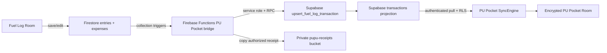

# Cross-app sync architecture

Status: release architecture, reviewed 2026-08-27 (PU Pocket 0.2.34 / Fuel Log 1.3.5).

Payment routing, compatibility, verification and rollout gates are specified in
[`docs/FUEL-PAYMENT-ROUTING.md`](docs/FUEL-PAYMENT-ROUTING.md). Deployment evidence
is recorded in the coordinated releases; do not infer deployment from source alone.

This document explains how Fuel Log and PU Pocket exchange data. Read it before changing sync code, database models, Firebase paths/rules, Supabase migrations/RPCs, receipt storage, or account/vehicle sharing.

## Non-negotiable invariants

1. Fuel Log is the source of truth for vehicles, fill-ups, and vehicle expenses. PU Pocket stores a finance-facing projection, not a second editable copy of a Fuel Log record.
2. The cross-app flow is one-way: **Fuel Log -> PU Pocket**. PU Pocket's own Room/Supabase sync remains bidirectional.
3. A Fuel Log source ID is stable. Fill-ups keep `external_source_id = <entryId>` for compatibility; vehicle expenses use `external_source_id = expense:<expenseId>` so the two Firestore collections cannot collide.
4. `(user_id, external_source, external_source_id)` stays unique. Retrying create/update events must update one transaction, never create duplicates.
5. Backend secrets never enter either APK. Only Firebase Cloud Functions may use the Supabase service-role key.
6. Imported receipts stay private. Persist Supabase object paths, not expiring signed URLs.
7. Deletion is propagated as a tombstone/soft delete; do not hard-delete user finance history from a client.
8. Firebase and Supabase are intentionally different schemas. When a **cross-app contract field** changes, update every affected model, encoder/decoder, adapter, RPC/schema, policy, and test. Do not try to mirror the entire databases.

## Topology

There are three related but separate sync mechanisms:

- Fuel Log device sync: Room <-> Firestore/Storage through `FirestoreSyncRepository`.
- Cross-app bridge: Firestore -> Firebase Function -> controlled Supabase RPC.
- PU Pocket device sync: encrypted Room <-> Supabase through an outbox and incremental pull.

Do not bypass these boundaries by calling Supabase directly from Fuel Log or Firebase directly from PU Pocket.

## Pairing and authorization

1. A signed-in PU Pocket user selects the category and legacy fallback account.
2. `create-fuel-log-link` creates a 10-minute, 10-character code. Supabase stores only its SHA-256 hash.
3. A signed-in Fuel Log user submits that code and selected vehicle IDs to the Firebase callable `redeemPupuLink`.
4. The callable verifies Firebase vehicle membership before using the server-only Supabase credential.
5. Supabase `redeem_fuel_log_link` locks and consumes the code once, then creates one active link per selected vehicle.
6. The callable backfills existing fill-ups and vehicle expenses with one shared bounded OCR budget. Later Firestore writes use their collection-specific document triggers.

The link identifies the PU Pocket owner/category. New bridge calls select an active
owned THB account from the source payment method or receipt evidence; missing or
ambiguous destinations enter an owner-only pending queue. Only legacy calls without
payment metadata may use the active linked fallback account. It does not transfer
vehicle ownership or merge the two family-sharing systems.

## Record contract

| Fuel Log / Firestore | Bridge transformation | PU Pocket / Supabase |
| --- | --- | --- |
| fill-up document ID | unchanged stable source identity | `external_source_id = <entryId>` |
| vehicle-expense document ID | prefix with `expense:` | `external_source_id = expense:<expenseId>` |
| constant source | `fuel_log` | `external_source` |
| `total` in baht | round once at boundary: `total * 100` | `amount_minor` as integer |
| `date` + `time` | interpret in Thailand (`+07:00`) | `transaction_date` |
| optional `paymentMethod` | explicit choice, then receipt evidence, no receipt means cash | `external_metadata.payment` + safe account selection |
| Firestore update/event time | compare source watermark under an identity lock | `fuel_log_import_versions` |
| vehicle/station/liters/price/odometer/full | JSON projection | `external_metadata` |
| HTTPS receipt URLs | validate, copy server-side | private `receiptPaths` |
| document deletion | RPC with `p_deleted = true` | `deleted_at` soft delete |

Fill-ups remain expenses in PU Pocket's canonical fuel category. Vehicle-expense
documents add `recordType = vehicle_expense`, `sourceCategory`, and `income` to
metadata. PU Pocket maps Fuel Log's built-in categories to owner-scoped finance
categories and uses `income` to choose transaction type. Unknown optional source
categories map to the bounded fallback category rather than creating arbitrary
category names.

Adding an optional metadata field should be additive and old readers must tolerate its absence. Renaming/removing a field, changing units, changing ID composition, changing time-zone handling, or changing money rounding is a breaking contract change.

## Conflict, ordering, and retry behavior

- Fuel Log's normal full device sync treats different local/cloud copies as a conflict. Save paths use `pushFuelEntry(entryId)` and `pushExpense(expenseId)` because the just-saved local record is authoritative and must trigger the bridge immediately.
- Firebase document triggers may retry. The Supabase uniqueness constraint and RPC make those retries idempotent.
- Payment-aware imports retain source watermarks, including deletes. Older or unversioned events cannot overwrite a watermarked decision. User retries route only their stored pending payloads, without inventing new source data.
- PU Pocket records a local mutation and its outbox row in one Room transaction. It pushes the outbox before pulling server rows.
- PU Pocket pulls parents before transactions, uses an overlapping incremental cursor, and does not overwrite a row with a pending local mutation.
- Supabase server timestamps and soft-delete tombstones are canonical. Device clocks are not conflict authority.
- A failed receipt copy may produce a partial receipt list while the financial transaction still imports. A later Firestore update can retry the copy/upsert.

## Critical implementation map

Fuel Log repository:

- `native-kotlin/.../data/firebase/FirestoreSyncRepository.kt`: Room/Firestore sync and immediate fill-up/expense pushes.
- `native-kotlin/.../data/firebase/PupuPocketLinkRepository.kt`: client side of pairing.
- `functions/index.js`: membership checks, mapping, receipt copy, backfill, Firestore trigger, Supabase calls.
- `firestore.rules`: vehicle membership and write authorization.

PU Pocket repository:

- `supabase/functions/create-fuel-log-link/index.ts`: authenticated pairing-code creation.
- `supabase/migrations/*fuel_log*`: append-only schema, RPC, uniqueness, and RLS contract.
- `data/.../sync/SyncOutbox.kt`: atomic local mutation/outbox recording.
- `data/.../sync/SyncEngine.kt`: push-first incremental Room/Supabase sync and external-field decoding.
- `data/.../local/entity/TransactionEntity.kt` and `domain/.../Transaction.kt`: local projection contract.

## Change gate

Before changing any item above:

1. Write the before/after contract and list both repositories affected.
2. Prefer additive backend changes first; keep old producer and consumer versions working.
3. Never edit an applied Supabase migration. Add a new timestamped migration.
4. Update both copies of this document and link companion PRs with the same feature slug.
5. Test create, edit, delete, retry/idempotency, backfill, receipts, login, language persistence, and both family-sharing systems.
6. Verify signed update installation without uninstalling either production app.

If the impact cannot be explained, stop and do not modify the sync contract.
